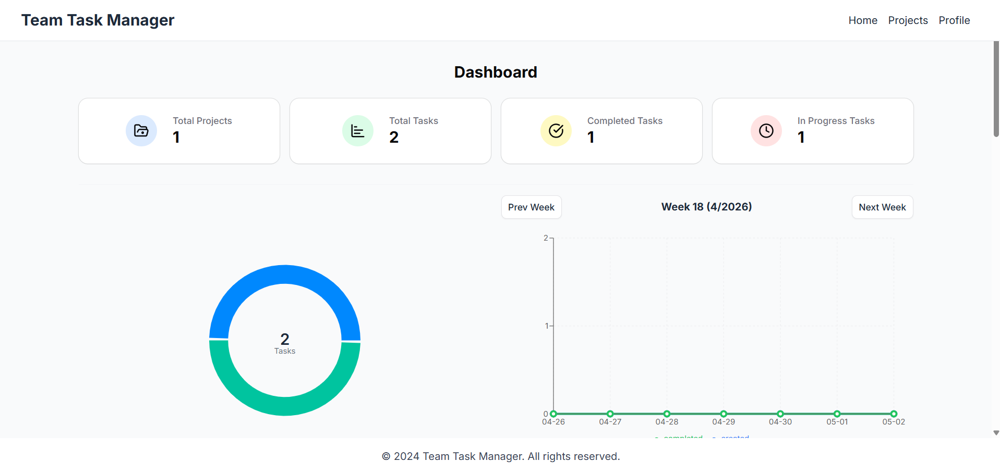
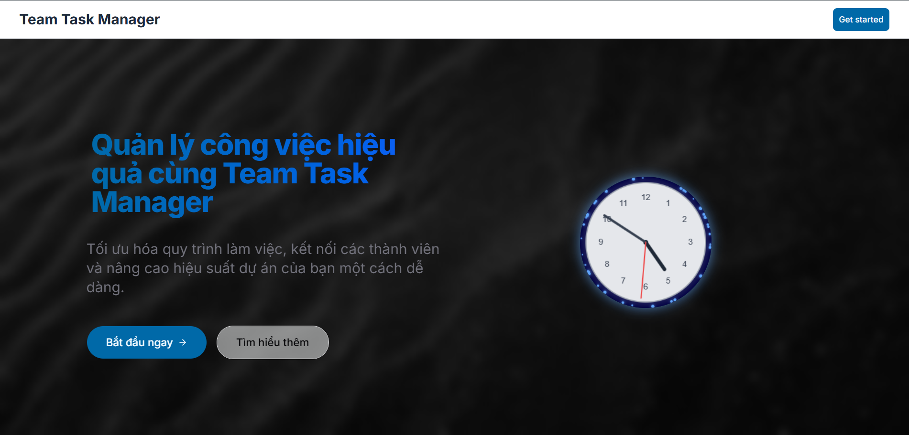
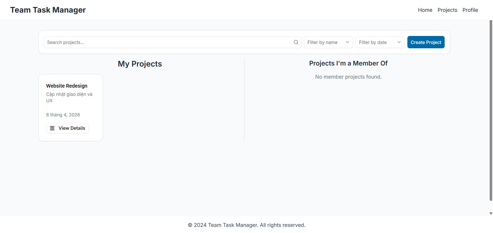
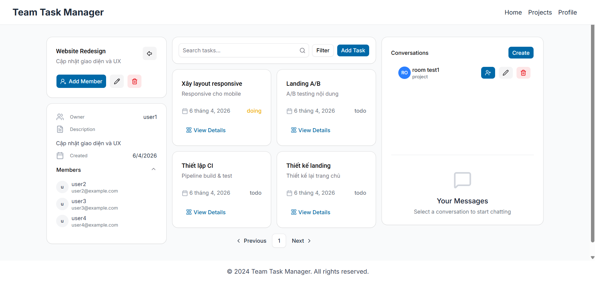

<div align="center">
  
  
  <h1>🚀 Team Task Manager</h1>
  <p><em>Hệ thống Quản lý Dự án & Công việc Toàn diện dành cho Đội nhóm</em></p>
</div>

---

## 📖 Giới thiệu

**Team Task Manager** là một ứng dụng web quản lý công việc và dự án mạnh mẽ, giúp các nhóm tổ chức, theo dõi và hoàn thành mục tiêu một cách hiệu quả. Với giao diện trực quan và tính năng đa dạng, hệ thống hỗ trợ từ việc lên kế hoạch dự án đến phân công chi tiết từng công việc.

## 🌟 Tính năng Nổi bật

- 🔐 **Xác thực & Phân quyền**: Đăng ký, đăng nhập an toàn với JWT. Quản lý hồ sơ người dùng.
- 📁 **Quản lý Dự án**: Tạo, chỉnh sửa, theo dõi tiến độ và quản lý thành viên dự án.
- ✅ **Quản lý Công việc**: Tạo task, phân công người thực hiện, đặt độ ưu tiên và thời hạn (Due Date).
- 🔍 **Tìm kiếm & Lọc**: Tìm kiếm nâng cao, lọc công việc theo trạng thái, độ ưu tiên, dự án.
- 📊 **Dashboard Tổng quan**: Theo dõi toàn cảnh tiến độ dự án bằng biểu đồ (Recharts).
- 🎨 **Giao diện Hiện đại**: Trải nghiệm mượt mà với Tailwind CSS, Shadcn UI và Framer Motion.

## 📸 Giao diện Ứng dụng

### Trang Landing


### Quản lý Dự án (Project)


### Quản lý Công việc (Task)


## 💻 Tech Stack

### Frontend
- **Framework**: React 19, Vite
- **Styling**: Tailwind CSS 4, Shadcn UI
- **State Management**: Zustand
- **Routing**: React Router DOM v7
- **Data Fetching**: Axios
- **Form Handling**: React Hook Form, Zod
- **Animations & Charts**: Framer Motion, Recharts

### Backend
- **Runtime**: Node.js
- **Framework**: Express.js
- **Database**: MongoDB (Mongoose)
- **Authentication**: JWT, bcryptjs
- **File Upload**: Multer

## 📂 Cấu trúc Dự án

```
team-task-manager/
├── frontend/     # Ứng dụng React (Vite)
├── backend/      # Máy chủ API Node.js/Express
└── README.md     # Tài liệu dự án
```

## 🚀 Hướng dẫn Cài đặt & Chạy Dự án

### Yêu cầu hệ thống
- Node.js (phiên bản 18+)
- MongoDB (Local hoặc MongoDB Atlas)

### Các bước cài đặt

**1. Clone dự án**
```bash
git clone <repo-url>
cd team-task-manager
```

**2. Cài đặt & Chạy Backend**
```bash
cd backend
npm install
npm run dev
```

**3. Cài đặt & Chạy Frontend (Mở Terminal mới)**
```bash
cd frontend
npm install
npm run dev
```

## 👤 Tác giả
- **Trần Hải Đăng**
